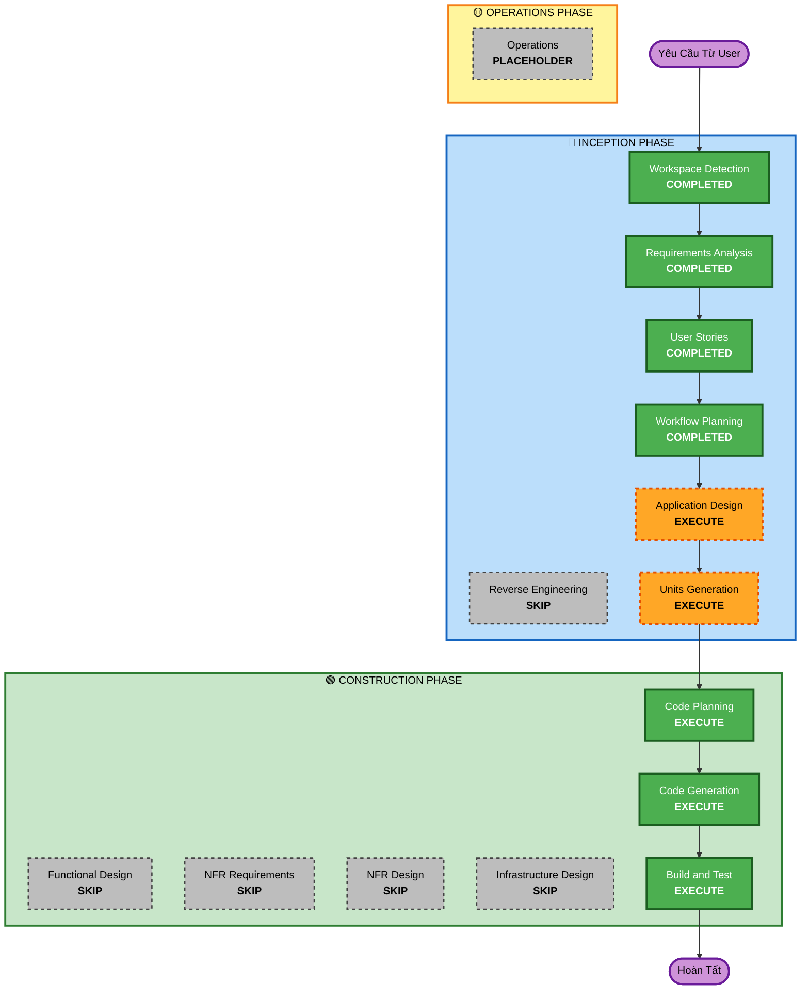

# Kế Hoạch Thực Thi (Execution Plan)

## Tóm Tắt Phân Tích Chi Tiết (Detailed Analysis Summary)

### Đánh Giá Tác Động Thay Đổi (Change Impact Assessment)
- **Thay đổi giao diện người dùng**: Có - Phát triển hệ thống quản trị Frontend SPA từ đầu (Vue 3).
- **Thay đổi cấu trúc dự án**: Có - Khởi tạo mô hình Monorepo chứa tách biệt Backend và Frontend.
- **Thay đổi mô hình dữ liệu**: Có - Xây dựng mới hoàn toàn các Schema dữ liệu bằng PostgreSQL/Prisma (Users, Customers, Products, Categories, Orders, Order_Items).
- **Thay đổi thiết kế API**: Có - Hệ thống backend NodeJS phục vụ 100% bằng RESTful API.
- **Tác động phi chức năng (NFR)**: Có - Thời gian phản hồi < 250ms API, UI render < 1.5s, xác thực JWT (mặc định cấu hình chuẩn).

### Đánh Giá Mức Độ Rủi Ro (Risk Assessment)
- **Mức độ rủi ro**: Trung bình (Medium) - Dự án khởi tạo từ đầu, không gây ảnh hưởng làm hỏng hệ thống cũ, nhưng cần thiết kế kỹ database và API.
- **Mức độ khôi phục (Rollback Complexity)**: Dễ (Easy) - Tích hợp quản quản lý bằng Git Flow rõ ràng.
- **Mức độ khó của Kiểm thử**: Trung bình (Moderate) - Yêu cầu E2E và Unit Test cho ứng dụng theo chuẩn BDD đã lên chi tiết ở User Stories.

## Trực Quan Hóa Luồng Công Việc (Workflow Visualization)

## Các Giai Đoạn Sẽ Thực Thi (Phases to Execute)

### 🔵 GIAI ĐOẠN KHỞI TẠO VÀ LẬP KẾ HOẠCH (INCEPTION PHASE)
- [x] Workspace Detection (COMPLETED)
- [x] Reverse Engineering (SKIPPED)
- [x] Requirements Elaboration (COMPLETED)
- [x] User Stories (COMPLETED)
- [x] Workflow Planning (COMPLETED)
- [ ] Application Design - **EXECUTE**
  - **Lý do**: Đây là một hệ thống Full-stack mới (Frontend và Backend). Cần quyết định cấu trúc thư mục, định nghĩa các API routes, model dữ liệu, store trạng thái (Pinia) cụ thể để lập trình viên áp dụng đồng nhất.
- [ ] Units Generation - **EXECUTE**
  - **Lý do**: Hệ thống cần được tách rời (Decomposed) thành tối thiểu 2 "Unit of Work" rõ rệt: Frontend Web App và Backend REST API. Cần phải chia nhỏ để triển khai làm code riêng biệt.

### 🟢 GIAI ĐOẠN XÁC LẬP VÀ XÂY DỰNG CODE (CONSTRUCTION PHASE)
- [ ] Functional Design - **SKIP**
  - **Lý do**: Các nghiệp vụ (Business Logic) hiện tại đã được phủ bằng User Stories chi tiết, chưa có mức độ phức tạp (như xử lý luồng AI, hàng đợi Queue hay Job chạy ẩn) nào vượt ngoài khả năng xây dựng CRUD cơ bản. Sẽ tận dụng Application Design là đủ.
- [ ] NFR Requirements - **SKIP**
  - **Lý do**: File định hướng `tech.md` đã chốt rõ ràng công nghệ (NodeJS, Vue 3) cũng như các cài đặt bảo mật (Bcrypt JWT). Hơn nữa user đã yêu cầu SKIP các quy chuẩn Security Baseline để theo hướng MVP. Ngầm định sử dụng NFR có sẵn.
- [ ] NFR Design - **SKIP**
  - **Lý do**: Kiến trúc hệ thống là chuẩn 3-Tier cơ bản, không cần dùng hệ kiến trúc vi dịch vụ (Microservices), không đòi hỏi Design lại các Pattern cao cấp về NFR.
- [ ] Infrastructure Design - **SKIP**
  - **Lý do**: Dự án sẽ triển khai dễ dàng bằng bộ Docker/PM2 thông thường đã nếu trong `tech.md`, chưa liên quan đến AWS/GCP CDK ngay lập tức.
- [ ] Code Planning - **EXECUTE (ALWAYS)**
  - **Lý do**: Bất kỳ Unit nào trước khi code cũng cần lên chi tiết các bước (File layout, Package dependencies...).
- [ ] Code Generation - **EXECUTE (ALWAYS)**
  - **Lý do**: Hoạt động viết mã cốt lõi.
- [ ] Build and Test - **EXECUTE (ALWAYS)**
  - **Lý do**: Đảm bảo khởi chạy thành công dự án trên môi trường Dev local và chạy Test thông suất.

### 🟡 GIAI ĐOẠN VẬN HÀNH (OPERATIONS PHASE)
- [ ] Operations - **PLACEHOLDER**
  - **Lý do**: Các công việc Deploy sau này.

## Thời Gian Ước Tính (Estimated Timeline)
- **Tổng số giai đoạn (Phases)**: Chạy 5 giai đoạn trọng yếu (Phase Khởi tạo) và 3 giai đoạn Sinh Mã Code.
- **Thời lượng ước tính**: ~15 đến 20 phút sinh nội dung tự động nếu không phát sinh lỗi.

## Tiêu Chí Thành Công (Success Criteria)
- **Mục Tiêu Chính**: Biên dịch ra được một hệ thống MVP cho quản lý bán hàng chuẩn theo ý định.
- **Thành Phẩm**: Repo Code Frontend (Vue 3/Vite/Tailwind) kết nối mượt với Backend (Node.js/Prisma/PostgreSQL).
- **Kiểm Soát Chất Lượng (Quality Gates)**: E2E Playwright và Unit Jest Test Pass cho các quy trình Order và Login.
