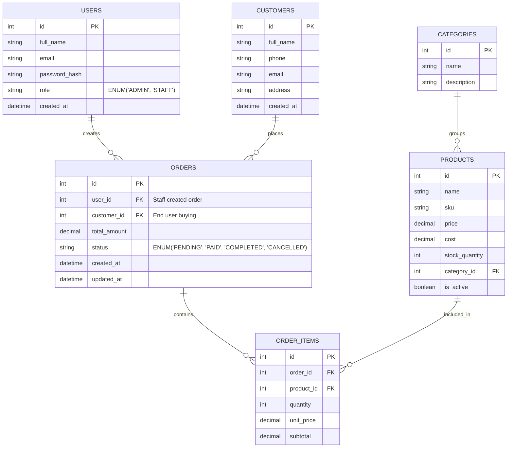

# Website Quản Lý Bán Hàng (Sales Management System)

## 1. Mục tiêu và Định hướng

### 1.1 Mục tiêu sản phẩm
Hệ thống phần mềm ứng dụng nhằm mục đích số hóa toàn bộ quy trình vận hành của một cửa hàng vừa và nhỏ. Hệ thống giúp quản lý nguồn hàng hóa chặt chẽ, theo dõi tiến độ đơn hàng, ghi nhận thông tin khách hàng tiềm năng và cung cấp số liệu thống kê thu chi một cách minh bạch, hiệu quả.

### 1.2 Định hướng nền tảng mạng
Hệ thống định hướng chạy dưới dạng Web Application trên mọi thiết bị:
- **Trải nghiệm người dùng:** Giao diện SPA (Single Page Application) mượt mà, phản hồi tức thời hạn chế reload trang.
- **Trải nghiệm quản trị:** Khả năng truy xuất lượng lớn dữ liệu nhanh chóng, phân tích tức thời (REST API kết hợp Relational DB).

---

## 2. Các nhóm nghiệp vụ cốt lõi

### 2.1 Quản lý Sản phẩm & Tồn kho (Product & Inventory Management)
- Xem thông tin, tạo mới, chỉnh sửa, xóa/ẩn sản phẩm.
- Bao gồm các trường định danh: Mã SKU, Tên, Hình ảnh.
- Dữ liệu tài chính: Giá bán lẻ chuẩn, Giá nhập (Cost).
- Quản lý định lượng: Trạng thái (Còn bán / Ngừng kinh doanh), Số lượng tồn kho.
- Khả năng lọc và tìm kiếm theo khoảng giá, trạng thái, danh mục hoặc cụm từ.

### 2.2 Phân nhóm Sản phẩm (Category Management)
- Tạo mới và điều hướng các danh mục lớn (VD: Đồ điện tử dân dụng, Thiết bị gia đình).
- Liên kết cấu trúc: Mỗi sản phẩm được gắn kết nhất quán tới một danh mục cha.

### 2.3 Hồ sơ Khách hàng (Customer Profile / CRM)
- Quản lý lý lịch: Họ tên, Số điện thoại dùng liên lạc/Zalo, Email, Địa chỉ giao hàng cơ bản.
- Hồ sơ tiêu dùng: Tự động ghi chép tổng chi tiêu, khoảng thời gian thực hiện đơn để cửa hàng đánh giá các tệp khách hàng trung thành.

### 2.4 Quản trị Đơn hàng (Order Processing & Fulfillment)
- Luồng tạo đơn: Định danh khách hàng mua, thêm linh hoạt các mã SKU sản phẩm có trong kho, tự động áp giá và tính tổng cộng.
- Vòng đời giao dịch (Order Status Lifecycle):
  1. `Pending` (Chờ thu tiền/Xử lý chuẩn bị hàng)
  2. `Paid` (Đã thanh toán) / `Processing` (Đang triển khai giao)
  3. `Completed` (Đơn hoàn thành)
  4. `Cancelled` (Bị hủy vì lý do phát sinh)

### 2.5 Hệ thống Theo dõi Thực trạng (Analytics, Reports)
- Theo dõi doanh thu theo thời gian (Ngày, Tuần qua, Tháng hiện tại).
- Số đo chi phí và tỷ lệ đơn hàng thành công so với đơn hủy.
- Bảng xếp hạng các mặt hàng tiêu thụ nhanh nhất (best-sellers) và cảnh báo sản phẩm chuẩn bị hết hàng.

---

## 3. Hệ thống Phân quyền Quản trị (Role-Based Access Control)

Các phân lớp vai trò nhằm gia cố bảo mật và trách nhiệm nội bộ:
- **Admin (Người quản trị cấp cao):** Theo dõi toàn cục. Cấu hình tham số hệ thống, quản lý tài khoản nhân sự (Staff), quan sát mọi báo cáo lợi nhuận.
- **Staff (Nhân viên Quầy / Sale):** Quyền lực ở mức vận hành/thực thi. Được phép lên đơn hàng, thay đổi trạng thái giao dịch, chăm sóc hồ sơ khách hàng.

---

## 4. Mô hình ERD (Entity Relationship Diagram)

---

## 5. Phạm vi Triển khai Phiên bản Tối giản (MVP Phasing)

Nhằm tối ưu tốc độ ra mắt sản phẩm cho khách, bản khởi tạo (MVP) tập trung giải quyết triệt để vấn đề:

### ✅ Mục tiêu hỗ trợ trong MVP (Giai đoạn 1):
- Quản trị Sản phẩm & Danh mục cơ sở (CRUD).
- Tạo luồng đơn hàng tĩnh, chuyển trạng thái đơn bằng tay.
- Kho chứa hồ sơ Khách hàng thiết yếu.
- Giao diện Dashboard (tính doanh thu cơ bản).
- Chức năng Ủy quyền bằng Token JWT Auth, phân dải quyền cho Admin/Staff.

### ❌ Trì hoãn phát triển (Dành cho Phase 2+):
- Các cổng thanh toán số hoá online (VNPAY, MoMo Payment Gateway, Stripe).
- Xử lý Kho bãi nâng cao (Theo dõi lô hàng, quét Barcode tự động, lịch sử nạp hàng).
- Triển khai phân tách quyền Đa chi nhánh hoặc đa kho hàng.
- Nền tảng cấu hình Notification tự động (Gửi Email/SMS báo thay đổi đơn).

---

## 6. Yêu cầu Phi Chức năng (NFR - Non-Functional Requirements)

1. **Giao diện (UI/UX):** Thiết kế Responsive cho thiết bị Ipad/Tablet tại các cửa tiệm và máy tính Desktop PC chuẩn.
2. **Hiệu năng hệ thống (Performance):** Trả về HTTP API thông thường trong định mức \< 250ms. Tải và dựng trang DOM VueJS đầu tiên \< 1.5 giây.
3. **Bảo mật và Rủi ro (Security & Compliance):** Mã hóa mật khẩu lưu DB qua thuật toán cấp Bcrypt (Salt round 10+). Khép kín API chống tấn công DDoS, CSRF bằng CORS nghiêm ngặt.
